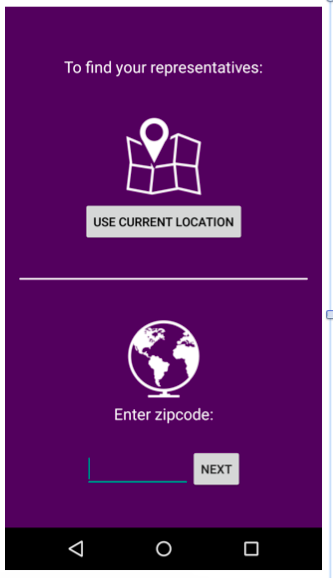
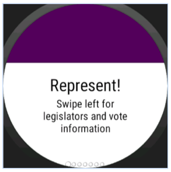

# PROG 02: Represent!

The Represent! phone and watch allow a user to enter their zipcode or use their current location to find their representatives in Congress and Senate. The watch app shows the same information as well as Presidential election vote percentages from 2012 and 2016. 

## Authors

Parul Singh ([parulsingh@berkeley.edu](mailto:parulsingh@berkeley.edu))

## Demo Video

See [Represent Demo] (https://youtu.be/rd6RZUH9H5M)

## Screenshots

## Acknowledgments
I used [Sunlight Foundation] (http://tryit.sunlightfoundation.com/congress) for representative/bills/committee information.
As well as the Google Geocoding API, and Twitter API to retreive tweets. 
I also used this [Circular Image View] (https://github.com/siyamed/android-shape-imageview) for UI elements in phone and watch. 
